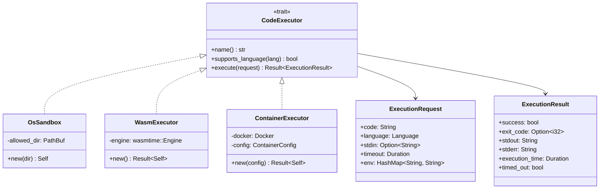

# OpenAgent System Design

> **Note:** This document is part of the modular documentation. For a quick overview, see the [Documentation Index](./README.md). For detailed module documentation, see:
> - [Architecture](./architecture.md) - System design principles
> - [Core Traits](./core-traits.md) - Trait abstractions
> - [Configuration](./configuration.md) - Config system
> - [Agent](./agent.md) | [Database](./database.md) | [Sandbox](./sandbox.md) | [Channels](./channels.md)
> - [Gateway Protocol](./gateway-protocol.md) | [Plugin SDK](./plugin-sdk.md)

This document describes the architecture, data flows, and component interactions of OpenAgent.

## Table of Contents

- [System Overview](#system-overview)
- [Architecture](#architecture)
- [Component Details](#component-details)
- [Data Flows](#data-flows)
- [CLI & User Experience](#cli--user-experience)
- [Agent Soul](#agent-soul)
- [Security Model](#security-model)
- [Deployment](#deployment)

---

## System Overview

OpenAgent is a high-performance AI agent framework built in Rust that provides:

- **Multi-model LLM access** via OpenRouter
- **Hybrid memory** using PostgreSQL + pgvector and OpenSearch
- **Secure code execution** through multi-tier sandboxing
- **Telegram bot interface** as the primary user interaction layer
- **Interactive CLI** with arrow-key navigation and fuzzy search
- **Customizable Agent Soul** for personality and behavior configuration


---

## Architecture

### High-Level Architecture


### Module Structure

OpenAgent follows a modular, loosely-coupled architecture inspired by [openclaw](https://github.com/openclaw/openclaw):


### Design Principles

OpenAgent's architecture follows these core principles:

1. **Trait-based Abstraction**: All major components (providers, channels, storage, executors) are defined as traits, enabling loose coupling and easy testing.

2. **Modular Configuration**: Configuration is split into focused modules rather than a single monolithic file:
   - `config/types/provider.rs` - LLM provider settings
   - `config/types/channel.rs` - Messaging channel settings
   - `config/types/storage.rs` - Database/storage settings
   - `config/types/sandbox.rs` - Code execution settings

3. **Plugin Architecture**: The `plugin_sdk` module provides interfaces for extending OpenAgent:
   - Register new LLM providers
   - Add messaging channels
   - Implement custom storage backends
   - Create new code executors

4. **Gateway Protocol**: WebSocket-based JSON protocol for client communication:
   - Request/Response pattern with message IDs
   - Event streaming for real-time updates
   - Session management
   - Authentication support

### Core Traits


---

## Component Details

### 1. Agent Module

The agent module handles all LLM-related functionality.


### 2. Database Module

Hybrid storage combining vector search and full-text search.


### 3. Sandbox Module

Multi-tier code execution with security isolation.



---

## Data Flows

### 1. Message Processing Flow


### 2. Code Execution Flow


### 3. Memory Search Flow

```mermaid
sequenceDiagram
    participant A as Agent
    participant M as MemoryStore
    participant P as PostgreSQL
    participant O as OpenSearch
    participant E as Embedding Service

    A->>M: search_semantic(query)
    A->>E: Generate query embedding
    E-->>A: Vector [f32; 1536]
    A->>M: search_semantic(user_id, embedding)
    M->>P: SELECT ... ORDER BY embedding <=> $1
    P-->>M: Similar memories by vector distance
    M-->>A: Vec<(Memory, similarity)>

    A->>M: search_fulltext(query)
    M->>O: Multi-match query
    O-->>M: SearchResults with highlights
    M->>P: Fetch full Memory records
    P-->>M: Memory details
    M-->>A: Vec<Memory>
```

### 4. Tool Execution Flow


---

## CLI & User Experience

### Interactive Terminal Interface

OpenAgent features a modern interactive CLI built with `dialoguer` and `console` crates, providing:

- **Arrow-key navigation** for menu selection
- **Fuzzy search** for model browsing
- **Colored output** with progress indicators
- **Interactive prompts** with defaults and validation


### CLI Command Structure


### Docker Auto-Setup Flow


---

## Agent Soul

### Overview

The Agent Soul (`SOUL.md`) defines the agent's personality, values, and behavioral guidelines. It's loaded as part of the system prompt and can evolve through conversations.


### Soul Structure


### Soul Update Flow


---

## Security Model

### Execution Environment Hierarchy


### Authentication & Authorization


---

## Deployment

### Docker Compose Architecture


### System Requirements

```mermaid
mindmap
    root((OpenAgent))
        Runtime
            Rust 1.70+
            Docker (optional)
        Databases
            PostgreSQL 15+
                pgvector extension
            OpenSearch 2.x
                (optional)
        External APIs
            OpenRouter API Key
            Telegram Bot Token
        Resources
            2GB+ RAM
            10GB+ Storage
            Network Access
```

### Configuration Flow

```mermaid
flowchart LR
    subgraph "Configuration Sources"
        ENV[.env file]
        ENVVAR[Environment Variables]
    end

    subgraph "Config Loading"
        LOAD[dotenvy::dotenv]
        PARSE[Config::from_env]
    end

    subgraph "Config Sections"
        OR_CFG[OpenRouterConfig]
        TG_CFG[TelegramConfig]
        DB_CFG[DatabaseConfig]
        OS_CFG[OpenSearchConfig]
        SB_CFG[SandboxConfig]
    end

    ENV --> LOAD
    ENVVAR --> LOAD
    LOAD --> PARSE
    PARSE --> OR_CFG
    PARSE --> TG_CFG
    PARSE --> DB_CFG
    PARSE --> OS_CFG
    PARSE --> SB_CFG
```

### Onboarding Flow

The CLI provides an interactive onboarding experience with arrow-key navigation and Docker auto-setup.

```mermaid
flowchart TD
    A[openagent onboard] --> B{.env exists?}
    B -->|No| C[Create from template]
    B -->|Yes| D[Load existing config]
    
    C --> E[Step 1: Port Config]
    D --> E
    
    E --> F[Find free port 20000-29999]
    F --> G[Step 2: OpenRouter]
    G --> H[Enter API key]
    H --> I[Select default model]
    I --> J[Step 3: Telegram]
    J --> K[Enter bot token]
    K --> L[Step 4: Database]
    
    L --> M{Docker available?}
    M -->|Yes| N[Show Docker options menu]
    M -->|No| O[Show manual config]
    
    N --> P{User choice?}
    P -->|Auto-start| Q[Start PostgreSQL container]
    P -->|Manual| O
    P -->|Skip| R[Continue without DB]
    
    Q --> S[Wait for ready]
    S --> T[Start OpenSearch container]
    T --> U[Wait for ready]
    U --> V{Run migrations?}
    V -->|Yes| W[Execute migrations]
    V -->|No| X[Step 5: Sandbox]
    W --> X
    
    O --> X
    R --> X
    
    X --> Y[Select execution env]
    Y --> Z[Save .env]
    Z --> AA[Verify connections]
    AA --> AB[Show summary]
```

### Port Discovery Algorithm

```mermaid
flowchart TD
    A[Start: port = 20000] --> B{port <= 29999?}
    B -->|Yes| C[Try bind 127.0.0.1:port]
    B -->|No| D[Return None]

    C --> E{Bind successful?}
    E -->|Yes| F[Release socket]
    E -->|No| G[port++]

    F --> H[Return Some port]
    G --> B

    style H fill:#4CAF50
    style D fill:#f44336
```

### Docker Container Management

```mermaid
flowchart TD
    subgraph "PostgreSQL Setup"
        PA[Check if running] --> PB{Running?}
        PB -->|Yes| PC[Use existing]
        PB -->|No| PD{Container exists?}
        PD -->|Yes| PE[docker start]
        PD -->|No| PF[docker run]
        PE --> PG[Wait pg_isready]
        PF --> PG
        PG --> PH[Ready]
    end
    
    subgraph "OpenSearch Setup"
        OA[Check if running] --> OB{Running?}
        OB -->|Yes| OC[Use existing]
        OB -->|No| OD{Container exists?}
        OD -->|Yes| OE[docker start]
        OD -->|No| OF[docker run]
        OE --> OG[Wait HTTP 200]
        OF --> OG
        OG --> OH[Ready]
    end
```

---

## Error Handling

```mermaid
graph TD
    subgraph "Error Types"
        E1[Config Error]
        E2[OpenRouter Error]
        E3[Database Error]
        E4[OpenSearch Error]
        E5[Telegram Error]
        E6[Sandbox Error]
        E7[Wasm Error]
        E8[Container Error]
        E9[HTTP Error]
        E10[I/O Error]
    end

    subgraph "Error Properties"
        P1{is_retryable?}
        P2{is_client_error?}
    end

    E2 --> P1
    E3 --> P1
    E4 --> P1
    E9 --> P1

    E1 --> P2
    E5 --> P2

    P1 -->|Yes| R[Retry with backoff]
    P1 -->|No| F[Fail immediately]
    P2 -->|Yes| U[Return user-friendly message]
    P2 -->|No| L[Log and continue]
```

---

## Future Considerations

```mermaid
timeline
    title OpenAgent Roadmap

    section Phase 1 - Foundation
        Core Framework : Telegram Gateway
                       : OpenRouter Integration
                       : Basic Sandboxing

    section Phase 2 - Memory
        Hybrid Memory : PostgreSQL + pgvector
                     : OpenSearch Integration
                     : Conversation Persistence

    section Phase 3 - Tools
        Tool Framework : File Operations
                      : Code Execution
                      : Web Search

    section Phase 4 - Advanced
        Multi-Agent : Agent Collaboration
                   : Task Delegation
                   : Workflow Automation
```
