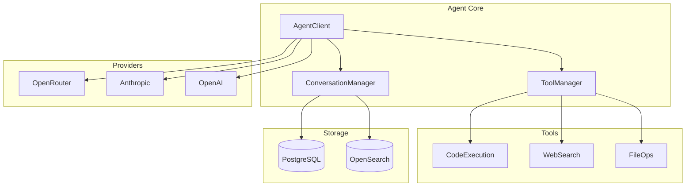
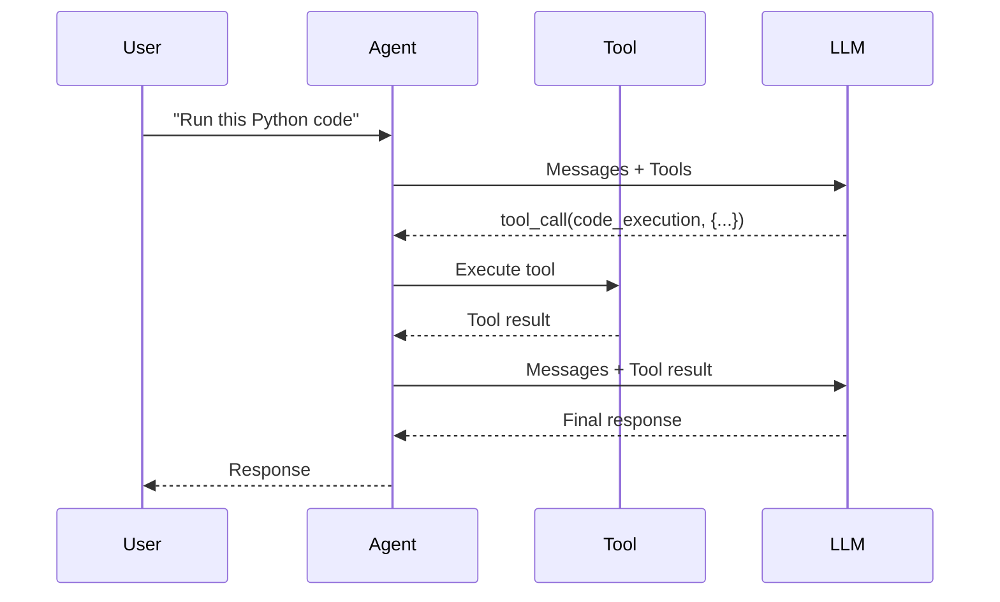

# Agent Module

The Agent module is the core of OpenAgent, orchestrating conversations between users and LLM providers. This document describes the agent architecture.

## Overview

The agent module handles:
- **Conversation management** - Multi-turn dialogue with context
- **Tool execution** - Code execution, web search, etc.
- **Memory integration** - Long-term memory retrieval
- **Provider abstraction** - Works with any LLM provider

## Architecture



## AgentClient

The main entry point for agent interactions:

```rust
use openagent::agent::{AgentClient, Message};

// Create client with configuration
let client = AgentClient::new(config).await?;

// Send a message and get response
let response = client.chat(
    "What is the capital of France?",
    ChatOptions::default()
).await?;

println!("{}", response.content);

// Streaming response
let stream = client.chat_stream(
    "Write a poem about coding",
    ChatOptions::default()
);

while let Some(chunk) = stream.next().await {
    print!("{}", chunk?.content);
}
```

### Configuration

```rust
pub struct AgentClient {
    /// LLM provider
    provider: Box<dyn LlmProvider>,
    /// Conversation manager
    conversation: ConversationManager,
    /// Tool manager
    tools: ToolManager,
    /// Storage backend
    storage: Box<dyn StorageBackend>,
    /// Agent configuration
    config: AgentConfig,
}

pub struct AgentConfig {
    /// Default model
    pub model: String,
    /// System prompt file
    pub system_prompt_file: Option<PathBuf>,
    /// Max context tokens
    pub max_context_tokens: u32,
    /// Thinking level (for extended thinking)
    pub thinking_level: ThinkingLevel,
    /// Enable verbose output
    pub verbose: bool,
}
```

## Conversation Management

### Creating Conversations

```rust
use openagent::agent::ConversationManager;

let manager = ConversationManager::new(storage.clone());

// Start new conversation
let conv = manager.create("telegram", "user123", Some(model)).await?;

// Or resume existing
let conv = manager.get_or_create("telegram", "user123").await?;
```

### Message History

```rust
// Add user message
manager.add_message(conv.id, Message::user("Hello!")).await?;

// Add assistant response
manager.add_message(conv.id, Message::assistant("Hi there!")).await?;

// Get conversation history
let messages = manager.get_messages(conv.id, 50).await?;

// Clear history
manager.clear_conversation(conv.id).await?;
```

### Context Window Management

The agent automatically manages the context window:

```rust
pub struct ContextManager {
    max_tokens: u32,
    messages: Vec<Message>,
}

impl ContextManager {
    /// Add message, potentially truncating old messages
    pub fn add(&mut self, message: Message) {
        self.messages.push(message);
        self.truncate_if_needed();
    }

    /// Truncate oldest messages to fit context window
    fn truncate_if_needed(&mut self) {
        let mut total_tokens = 0;
        let mut keep_from = 0;

        for (i, msg) in self.messages.iter().rev().enumerate() {
            total_tokens += estimate_tokens(&msg.content);
            if total_tokens > self.max_tokens {
                keep_from = self.messages.len() - i;
                break;
            }
        }

        if keep_from > 0 {
            self.messages = self.messages[keep_from..].to_vec();
        }
    }
}
```

## System Prompt (SOUL.md)

The system prompt defines the agent's personality:

```rust
pub struct SystemPrompt {
    base: String,
    additions: Vec<String>,
}

impl SystemPrompt {
    /// Load from SOUL.md file
    pub fn from_file(path: &Path) -> Result<Self> {
        let content = std::fs::read_to_string(path)?;
        Ok(Self {
            base: content,
            additions: vec![],
        })
    }

    /// Add context-specific instructions
    pub fn with_addition(&mut self, text: impl Into<String>) -> &mut Self {
        self.additions.push(text.into());
        self
    }

    /// Render full prompt
    pub fn render(&self) -> String {
        let mut prompt = self.base.clone();
        for addition in &self.additions {
            prompt.push_str("\n\n");
            prompt.push_str(addition);
        }
        prompt
    }
}
```

Example SOUL.md:
```markdown
# OpenAgent

You are OpenAgent, a helpful AI assistant.

## Capabilities
- Answer questions accurately
- Execute code when asked
- Search the web for current information
- Remember context from conversation

## Guidelines
- Be concise but thorough
- Use code blocks for code
- Cite sources when using web search
- Ask for clarification when needed
```

## Tool Integration

The agent can use tools to extend its capabilities:

### Available Tools

| Tool | Description |
|------|-------------|
| `code_execution` | Execute Python, JS, etc. |
| `web_search` | Search the web using DuckDuckGo (no API key required) |
| `brave_search` | Search the web using Brave Search API |
| `perplexity_search` | AI-powered search using Perplexity API |
| `file_read` | Read files |
| `file_write` | Write files |
| `memory_store` | Store memories |
| `memory_search` | Search memories |

### Web Search Tools

OpenAgent includes three web search tools:

#### DuckDuckGo Search (Default - No API Key Required)

The default web search tool that works without any API key:

```rust
use openagent::agent::DuckDuckGoSearchTool;

// Create the default search tool - no configuration needed!
let search = DuckDuckGoSearchTool::new();

// Or with custom timeout
let search = DuckDuckGoSearchTool::with_timeout(60);

// Register with tool manager
tools.register(search);
```

This tool uses DuckDuckGo's Instant Answer API with HTML scraping fallback for comprehensive results.

#### Brave Search

Traditional web search using Brave's privacy-focused search API:

```rust
use openagent::agent::{BraveSearchTool, BraveSearchConfig};

// Configure from environment (BRAVE_API_KEY)
let brave = BraveSearchTool::from_env()
    .expect("BRAVE_API_KEY required");

// Or manual configuration
let brave = BraveSearchTool::new(BraveSearchConfig {
    api_key: "your-api-key".to_string(),
    timeout_secs: 30,
    result_count: 10,
});

// Register with tool manager
tools.register(brave);
```

Environment variables:
- `BRAVE_API_KEY` (required) - Your Brave Search API key
- `BRAVE_TIMEOUT` (optional) - Request timeout in seconds (default: 30)
- `BRAVE_RESULT_COUNT` (optional) - Default result count (default: 10)

#### Perplexity Search

AI-powered search with synthesized answers:

```rust
use openagent::agent::{PerplexitySearchTool, PerplexityConfig};

// Configure from environment
let perplexity = PerplexitySearchTool::from_env()
    .expect("PERPLEXITY_API_KEY or OPENROUTER_API_KEY required");

// Or manual configuration
let perplexity = PerplexitySearchTool::new(PerplexityConfig {
    api_key: "your-api-key".to_string(),
    use_openrouter: false,  // true for OpenRouter proxy
    openrouter_api_key: None,
    timeout_secs: 30,
    model: "sonar-pro".to_string(),
});

tools.register(perplexity);
```

Environment variables:
- `PERPLEXITY_API_KEY` (optional) - Direct Perplexity API key
- `OPENROUTER_API_KEY` (optional) - OpenRouter API key (fallback)
- `PERPLEXITY_TIMEOUT` (optional) - Request timeout in seconds (default: 30)
- `PERPLEXITY_MODEL` (optional) - Model to use (default: perplexity/sonar-pro)

Note: Either `PERPLEXITY_API_KEY` or `OPENROUTER_API_KEY` is required for Perplexity search.

### Tool Registration

```rust
use openagent::agent::{Tool, ToolManager, ToolResult};

let mut tools = ToolManager::new();

// Register code execution
tools.register(CodeExecutionTool::new(sandbox));

// Register web search
tools.register(WebSearchTool::new(search_client));

// Custom tool
tools.register(CustomTool {
    name: "calculator".to_string(),
    description: "Perform mathematical calculations".to_string(),
    handler: |params| async {
        // Handle calculation
        Ok(ToolResult::success("42"))
    }
});
```

### Tool Execution Flow



## Memory Integration

The agent can store and retrieve long-term memories:

```rust
use openagent::agent::MemoryManager;

let memory = MemoryManager::new(storage, embedding_model);

// Store a memory
memory.store(
    conv.id,
    "User prefers Python for examples",
    0.8,  // importance
).await?;

// Retrieve relevant memories
let relevant = memory.search(
    "programming language preference",
    5,  // top k
).await?;

// Auto-inject into conversation
let context = memory.get_context_for(
    &current_message,
    3,  // max memories
).await?;
```

## Chat Options

Customize each chat request:

```rust
pub struct ChatOptions {
    /// Model to use
    pub model: Option<String>,
    /// Conversation ID (for continuity)
    pub conversation_id: Option<Uuid>,
    /// Temperature
    pub temperature: Option<f32>,
    /// Max tokens in response
    pub max_tokens: Option<u32>,
    /// Enable streaming
    pub stream: bool,
    /// Enable tool use
    pub tools_enabled: bool,
    /// Thinking level (for extended thinking)
    pub thinking_level: Option<ThinkingLevel>,
}

impl Default for ChatOptions {
    fn default() -> Self {
        Self {
            model: None,
            conversation_id: None,
            temperature: None,
            max_tokens: None,
            stream: true,
            tools_enabled: true,
            thinking_level: None,
        }
    }
}
```

## Extended Thinking

For complex reasoning, use extended thinking:

```rust
let response = client.chat(
    "Solve this complex math problem...",
    ChatOptions {
        thinking_level: Some(ThinkingLevel::High),
        ..Default::default()
    }
).await?;

// Access thinking output
if let Some(thinking) = &response.thinking {
    println!("Thinking: {}", thinking);
}
```

### Thinking Levels

| Level | Description | Use Case |
|-------|-------------|----------|
| `None` | No extended thinking | Simple queries |
| `Low` | Brief reasoning | Medium complexity |
| `Medium` | Moderate reasoning | Complex tasks |
| `High` | Deep reasoning | Very complex problems |

## Response Format

```rust
pub struct ChatResponse {
    /// Response content
    pub content: String,
    /// Model used
    pub model: String,
    /// Conversation ID
    pub conversation_id: Uuid,
    /// Tool calls made
    pub tool_calls: Vec<ToolCall>,
    /// Tool results
    pub tool_results: Vec<ToolResult>,
    /// Extended thinking output
    pub thinking: Option<String>,
    /// Token usage
    pub usage: UsageStats,
    /// Finish reason
    pub finish_reason: FinishReason,
}
```

## Error Handling

```rust
use openagent::error::{Error, Result};

async fn chat_with_retry(client: &AgentClient, msg: &str) -> Result<ChatResponse> {
    let mut attempts = 0;
    
    loop {
        match client.chat(msg, ChatOptions::default()).await {
            Ok(response) => return Ok(response),
            Err(Error::Provider(e)) if attempts < 3 => {
                attempts += 1;
                tokio::time::sleep(Duration::from_secs(2u64.pow(attempts))).await;
            }
            Err(e) => return Err(e),
        }
    }
}
```

## Next Steps

- [Core Traits](./core-traits.md) - LlmProvider trait details
- [Configuration](./configuration.md) - Agent configuration
- [Sandbox](./sandbox.md) - Code execution
- [Database](./database.md) - Conversation storage
