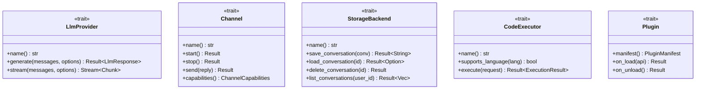

# Core Traits

OpenAgent uses trait-based abstractions to achieve loose coupling between components. This document describes the core traits that define the framework's extension points.

## Overview



## LlmProvider Trait

The `LlmProvider` trait defines the interface for LLM backends.

### Definition

```rust
/// LLM provider trait - implement this to add new LLM backends
#[async_trait]
pub trait LlmProvider: Send + Sync {
    /// Provider name (e.g., "openrouter", "anthropic")
    fn name(&self) -> &str;

    /// Generate a response (non-streaming)
    async fn generate(
        &self,
        messages: Vec<Message>,
        options: GenerationOptions,
    ) -> Result<LlmResponse>;

    /// Generate a streaming response
    fn stream(
        &self,
        messages: Vec<Message>,
        options: GenerationOptions,
    ) -> Pin<Box<dyn Stream<Item = Result<StreamingChunk>> + Send + '_>>;

    /// List available models (optional)
    async fn list_models(&self) -> Result<Vec<ModelInfo>> {
        Ok(vec![])
    }

    /// Check if a model is available
    async fn is_model_available(&self, model: &str) -> bool {
        true
    }
}
```

### Associated Types

```rust
/// Options for LLM generation
pub struct GenerationOptions {
    pub model: Option<String>,
    pub max_tokens: Option<u32>,
    pub temperature: Option<f32>,
    pub top_p: Option<f32>,
    pub stop_sequences: Vec<String>,
    pub tools: Vec<ToolDefinition>,
    pub thinking_level: ThinkingLevel,
}

/// LLM response
pub struct LlmResponse {
    pub content: String,
    pub model: String,
    pub finish_reason: Option<String>,
    pub usage: Option<UsageStats>,
    pub tool_calls: Vec<ToolCall>,
}

/// Streaming chunk
pub struct StreamingChunk {
    pub delta: String,
    pub finish_reason: Option<String>,
    pub usage: Option<UsageStats>,
}
```

### Implementations

| Implementation | Description |
|----------------|-------------|
| `OpenRouterClient` | Multi-model gateway via OpenRouter API |
| `AnthropicClient` | Direct Anthropic Claude API |
| `OpenAIClient` | OpenAI GPT models |

## Channel Trait

The `Channel` trait defines the interface for messaging platforms.

### Definition

```rust
/// Messaging channel trait - implement to add new platforms
#[async_trait]
pub trait Channel: Send + Sync {
    /// Channel identifier (e.g., "telegram", "discord")
    fn name(&self) -> &str;

    /// Start the channel (begin receiving messages)
    async fn start(&mut self) -> Result<()>;

    /// Stop the channel
    async fn stop(&mut self) -> Result<()>;

    /// Send a reply to a message
    async fn send(&self, reply: ChannelReply) -> Result<()>;

    /// Get channel capabilities
    fn capabilities(&self) -> ChannelCapabilities;

    /// Handle incoming message (called by framework)
    async fn on_message(&self, message: ChannelMessage) -> Result<Option<ChannelReply>>;
}

/// Channel capabilities
pub struct ChannelCapabilities {
    pub markdown: bool,
    pub code_blocks: bool,
    pub images: bool,
    pub files: bool,
    pub reactions: bool,
    pub threads: bool,
    pub max_message_length: Option<usize>,
}
```

### Message Types

```rust
/// Incoming message from a channel
pub struct ChannelMessage {
    pub id: String,
    pub channel_id: String,
    pub user_id: String,
    pub content: String,
    pub attachments: Vec<Attachment>,
    pub reply_to: Option<String>,
    pub timestamp: DateTime<Utc>,
}

/// Reply to send back
pub struct ChannelReply {
    pub channel_id: String,
    pub content: String,
    pub reply_to: Option<String>,
    pub attachments: Vec<Attachment>,
    pub parse_mode: Option<ParseMode>,
}
```

### Implementations

| Implementation | Description |
|----------------|-------------|
| `TelegramChannel` | Telegram Bot API (polling/webhook) |
| `DiscordChannel` | Discord Gateway API |
| `SlackChannel` | Slack Events API |
| `WebChatChannel` | Browser-based chat widget |

## StorageBackend Trait

The `StorageBackend` trait defines persistence interfaces.

### Definition

```rust
/// Storage backend trait for conversation persistence
#[async_trait]
pub trait StorageBackend: Send + Sync {
    /// Backend name
    fn name(&self) -> &str;

    /// Save a conversation, returns conversation ID
    async fn save_conversation(&self, conversation: &Conversation) -> Result<String>;

    /// Load a conversation by ID
    async fn load_conversation(&self, id: &str) -> Result<Option<Conversation>>;

    /// Delete a conversation
    async fn delete_conversation(&self, id: &str) -> Result<()>;

    /// List conversations for a user
    async fn list_conversations(
        &self,
        user_id: &str,
        limit: usize,
        offset: usize,
    ) -> Result<Vec<ConversationSummary>>;
}

/// Memory storage backend (for RAG)
#[async_trait]
pub trait MemoryBackend: Send + Sync {
    /// Save a memory with embedding
    async fn save(&self, memory: &Memory, embedding: &[f32]) -> Result<String>;

    /// Search by semantic similarity
    async fn search_semantic(
        &self,
        user_id: &str,
        embedding: &[f32],
        limit: usize,
    ) -> Result<Vec<(Memory, f32)>>;
}

/// Full-text search backend
#[async_trait]
pub trait SearchBackend: Send + Sync {
    /// Index a document
    async fn index(&self, doc: SearchDocument) -> Result<()>;

    /// Full-text search
    async fn search(
        &self,
        query: &str,
        user_id: Option<&str>,
        limit: usize,
    ) -> Result<Vec<SearchResult>>;
}
```

### Implementations

| Implementation | Description |
|----------------|-------------|
| `PostgresBackend` | PostgreSQL with pgvector |
| `SqliteBackend` | Local SQLite database |
| `OpenSearchBackend` | OpenSearch full-text search |
| `InMemoryBackend` | Ephemeral in-memory storage |

## CodeExecutor Trait

The `CodeExecutor` trait defines safe code execution.

### Definition

```rust
/// Code executor trait for sandboxed execution
#[async_trait]
pub trait CodeExecutor: Send + Sync {
    /// Executor name
    fn name(&self) -> &str;

    /// Check if language is supported
    fn supports_language(&self, language: Language) -> bool;

    /// Execute code
    async fn execute(&self, request: ExecutionRequest) -> Result<ExecutionResult>;

    /// Get supported languages
    fn supported_languages(&self) -> Vec<Language> {
        vec![]
    }
}
```

### Request/Response Types

```rust
/// Code execution request
pub struct ExecutionRequest {
    pub code: String,
    pub language: Language,
    pub stdin: Option<String>,
    pub timeout: Duration,
    pub env: HashMap<String, String>,
    pub working_dir: Option<PathBuf>,
}

/// Execution result
pub struct ExecutionResult {
    pub success: bool,
    pub exit_code: Option<i32>,
    pub stdout: String,
    pub stderr: String,
    pub execution_time: Duration,
    pub timed_out: bool,
}

/// Supported languages
pub enum Language {
    Python,
    JavaScript,
    TypeScript,
    Rust,
    Go,
    Shell,
    Ruby,
    Other(String),
}
```

### Implementations

| Implementation | Description |
|----------------|-------------|
| `OsSandbox` | OS-level with directory restriction |
| `WasmExecutor` | Wasmtime-based isolation |
| `ContainerExecutor` | Docker container isolation |

## Plugin Trait

The `Plugin` trait enables external extensions.

### Definition

```rust
/// Plugin trait for extensions
pub trait Plugin: Send + Sync {
    /// Get plugin manifest
    fn manifest(&self) -> PluginManifest;

    /// Called when plugin is loaded
    fn on_load(&mut self, api: &mut dyn PluginApi) -> Result<()>;

    /// Called when plugin is unloaded
    fn on_unload(&mut self) -> Result<()>;
}

/// Plugin API for registering components
pub trait PluginApi {
    /// Register a channel
    fn register_channel(&mut self, channel: Box<dyn Channel>);

    /// Register an LLM provider
    fn register_provider(&mut self, provider: Box<dyn LlmProvider>);

    /// Register a storage backend
    fn register_storage(&mut self, storage: Box<dyn StorageBackend>);

    /// Register a code executor
    fn register_executor(&mut self, executor: Box<dyn CodeExecutor>);

    /// Get configuration
    fn config(&self) -> &Config;
}
```

## Creating Custom Implementations

### Example: Custom Provider

```rust
use openagent::core::{LlmProvider, Message, GenerationOptions, LlmResponse};
use async_trait::async_trait;

pub struct MyCustomProvider {
    api_key: String,
}

#[async_trait]
impl LlmProvider for MyCustomProvider {
    fn name(&self) -> &str {
        "my-provider"
    }

    async fn generate(
        &self,
        messages: Vec<Message>,
        options: GenerationOptions,
    ) -> Result<LlmResponse> {
        // Your implementation here
        todo!()
    }

    fn stream(
        &self,
        messages: Vec<Message>,
        options: GenerationOptions,
    ) -> Pin<Box<dyn Stream<Item = Result<StreamingChunk>> + Send + '_>> {
        // Your implementation here
        todo!()
    }
}
```

## Next Steps

- [Configuration](./configuration.md) - Configure providers, channels, and storage
- [Plugin SDK](./plugin-sdk.md) - Build and distribute plugins
- [API Reference](./api-reference.md) - Complete API documentation
