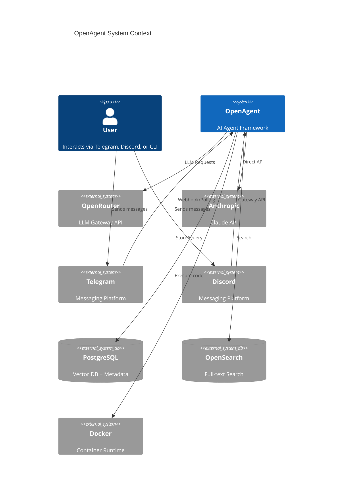
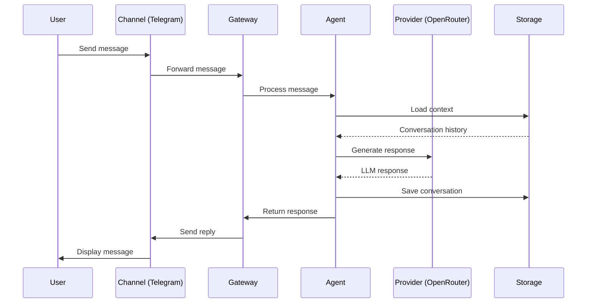

# Architecture Overview

This document describes the high-level architecture of OpenAgent, a modular AI agent framework built in Rust.

## System Context

OpenAgent is designed as a loosely-coupled, extensible framework that can integrate with multiple LLM providers, messaging channels, storage backends, and code execution environments.



## Module Structure

OpenAgent follows a modular, loosely-coupled architecture inspired by [openclaw](https://github.com/openclaw/openclaw):

```
src/
├── lib.rs              # Library root with re-exports
├── error.rs            # Domain-organized error types
│
├── core/               # Core trait abstractions
│   ├── mod.rs
│   ├── provider.rs     # LlmProvider trait
│   ├── channel.rs      # Channel trait
│   ├── storage.rs      # StorageBackend trait
│   ├── executor.rs     # CodeExecutor trait
│   └── types.rs        # Message, Role, etc.
│
├── config/             # Modular configuration
│   ├── mod.rs
│   ├── io.rs           # load_config(), save_config()
│   ├── paths.rs        # Directory utilities
│   ├── validation.rs   # Config validation
│   └── types/
│       ├── mod.rs      # Config, AgentConfig
│       ├── provider.rs # OpenRouterConfig, etc.
│       ├── channel.rs  # TelegramConfig, etc.
│       ├── storage.rs  # PostgresConfig, etc.
│       └── sandbox.rs  # SandboxConfig, etc.
│
├── agent/              # LLM interaction
│   ├── mod.rs
│   ├── client.rs       # OpenRouterClient
│   ├── conversation.rs # ConversationManager
│   ├── prompts.rs      # Prompt templates
│   ├── tools.rs        # Tool registry
│   └── types.rs        # Agent-specific types
│
├── database/           # Storage backends
│   ├── mod.rs
│   ├── postgres.rs     # PostgreSQL + pgvector
│   ├── opensearch.rs   # OpenSearch client
│   └── memory.rs       # MemoryStore
│
├── sandbox/            # Code execution
│   ├── mod.rs
│   ├── executor.rs     # Executor factory
│   ├── os_sandbox.rs   # OS-level sandbox
│   ├── wasm.rs         # Wasmtime executor
│   └── container.rs    # Docker executor
│
├── gateway/            # WebSocket control plane
│   ├── mod.rs
│   └── protocol/
│       ├── mod.rs
│       ├── schema.rs   # GatewayFrame, errors
│       └── types.rs    # Request/Response types
│
├── plugin_sdk/         # Extension framework
│   ├── mod.rs
│   ├── manifest.rs     # PluginManifest
│   ├── traits.rs       # Plugin, PluginApi
│   └── registry.rs     # PluginRegistry
│
└── bin/
    ├── cli.rs          # Interactive CLI
    └── gateway.rs      # Telegram gateway
```

## Design Principles

### 1. Trait-based Abstraction

All major components are defined as traits, enabling:
- **Loose coupling** between modules
- **Easy testing** with mock implementations
- **Extensibility** through custom implementations

```rust
// Example: LlmProvider trait
pub trait LlmProvider: Send + Sync {
    fn name(&self) -> &str;
    async fn generate(&self, messages: Vec<Message>, options: GenerationOptions) 
        -> Result<LlmResponse>;
    fn stream(&self, messages: Vec<Message>, options: GenerationOptions) 
        -> Pin<Box<dyn Stream<Item = Result<StreamingChunk>> + Send>>;
}
```

### 2. Modular Configuration

Configuration is split into focused modules:

| Module | Purpose |
|--------|---------|
| `config/types/provider.rs` | LLM provider settings (API keys, models) |
| `config/types/channel.rs` | Messaging channel settings (tokens, policies) |
| `config/types/storage.rs` | Database settings (connections, pools) |
| `config/types/sandbox.rs` | Execution settings (environments, limits) |

### 3. Plugin Architecture

The Plugin SDK enables extending OpenAgent with:
- Custom LLM providers
- New messaging channels
- Additional storage backends
- Custom code executors

### 4. Gateway Protocol

WebSocket-based JSON protocol for:
- Request/Response communication
- Real-time event streaming
- Session management
- Authentication

## Data Flow



## Security Model

OpenAgent implements defense-in-depth:

1. **Input Validation** - All inputs sanitized before processing
2. **Rate Limiting** - Per-user and global rate limits
3. **Sandboxed Execution** - Three-tier isolation (OS, Wasm, Container)
4. **Access Control** - Configurable allow-lists per channel
5. **Secret Management** - Sensitive values stored as `SecretString`

## Next Steps

- [Core Traits](./core-traits.md) - Deep dive into trait abstractions
- [Configuration](./configuration.md) - Configuration system details
- [Plugin SDK](./plugin-sdk.md) - Building extensions
