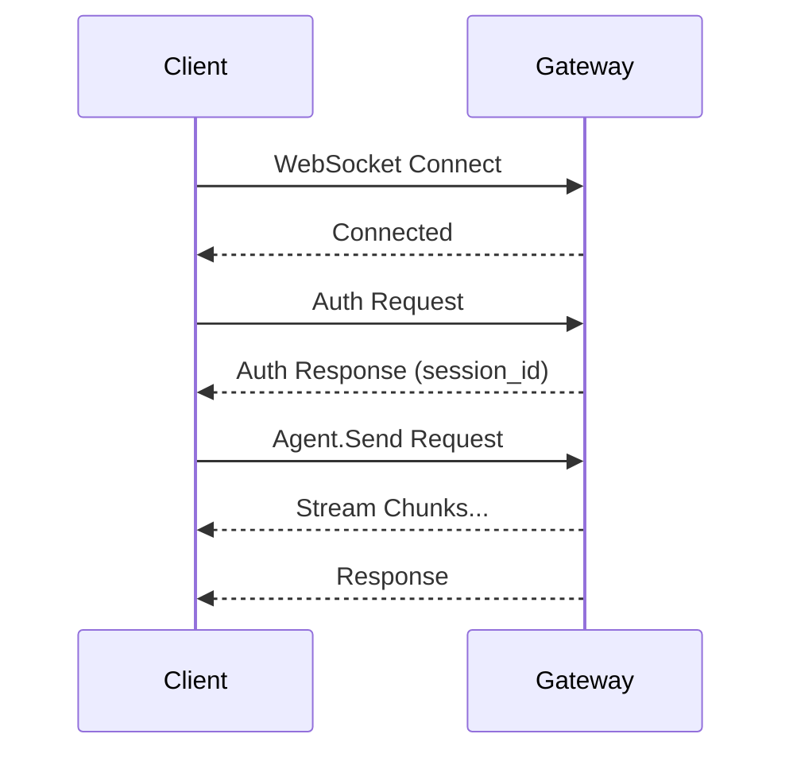

# Gateway Protocol

OpenAgent provides a WebSocket-based control plane for client communication. This document describes the gateway protocol.

## Overview

The gateway protocol enables:
- **Request/Response communication** with unique message IDs
- **Event streaming** for real-time updates (typing, streaming tokens)
- **Session management** for multi-turn conversations
- **Authentication** via tokens or passwords

## Connection

### WebSocket Endpoint

```
ws://localhost:18789/ws
wss://your-domain.com/ws  (production)
```

### Connection Flow



## Message Format

All messages are JSON-encoded `GatewayFrame` envelopes:

### Frame Types

```typescript
type GatewayFrame = 
  | { type: "request"; id: string; method: string; params: any }
  | { type: "response"; id: string; result?: any; error?: ProtocolError }
  | { type: "event"; event: string; data: any; session_id?: string; timestamp?: number }
  | { type: "error"; id?: string; error: ProtocolError }
  | { type: "ping"; id: string }
  | { type: "pong"; id: string }
```

### Protocol Error

```typescript
interface ProtocolError {
  code: number;
  message: string;
  data?: any;
}
```

## Error Codes

| Code | Name | Description |
|------|------|-------------|
| -32700 | PARSE_ERROR | Invalid JSON |
| -32600 | INVALID_REQUEST | Invalid request structure |
| -32601 | METHOD_NOT_FOUND | Unknown method |
| -32602 | INVALID_PARAMS | Invalid parameters |
| -32603 | INTERNAL_ERROR | Internal server error |
| -32000 | AUTH_REQUIRED | Authentication required |
| -32001 | AUTH_FAILED | Authentication failed |
| -32002 | RATE_LIMITED | Too many requests |
| -32003 | SESSION_NOT_FOUND | Session not found |
| -32004 | CHANNEL_NOT_AVAILABLE | Channel unavailable |

## Methods

### Authentication

#### `auth.login`

Authenticate and get a session.

**Request:**
```json
{
  "type": "request",
  "id": "1",
  "method": "auth.login",
  "params": {
    "method": "token",
    "token": "your-api-token"
  }
}
```

**Response:**
```json
{
  "type": "response",
  "id": "1",
  "result": {
    "success": true,
    "session_id": "sess_abc123",
    "client_id": "client_xyz"
  }
}
```

### Sessions

#### `sessions.list`

List active sessions.

**Request:**
```json
{
  "type": "request",
  "id": "2",
  "method": "sessions.list",
  "params": {
    "limit": 10
  }
}
```

**Response:**
```json
{
  "type": "response",
  "id": "2",
  "result": {
    "sessions": [
      {
        "id": "sess_abc123",
        "channel_id": "telegram",
        "conversation_id": "conv_xyz",
        "user_id": "user_123",
        "model": "anthropic/claude-sonnet-4",
        "created_at": 1706745600,
        "last_activity_at": 1706749200,
        "message_count": 15
      }
    ]
  }
}
```

#### `sessions.create`

Create a new session.

**Request:**
```json
{
  "type": "request",
  "id": "3",
  "method": "sessions.create",
  "params": {
    "model": "anthropic/claude-sonnet-4",
    "system_prompt": "You are a helpful assistant."
  }
}
```

### Agent Methods

#### `agent.send`

Send a message to the agent.

**Request:**
```json
{
  "type": "request",
  "id": "4",
  "method": "agent.send",
  "params": {
    "session_id": "sess_abc123",
    "message": "What is the capital of France?",
    "stream": true,
    "model": "anthropic/claude-sonnet-4"
  }
}
```

**Streaming Response (multiple events):**
```json
{
  "type": "event",
  "event": "stream.chunk",
  "data": {
    "session_id": "sess_abc123",
    "index": 0,
    "delta": "The capital",
    "is_final": false
  }
}
```

```json
{
  "type": "event",
  "event": "stream.chunk",
  "data": {
    "session_id": "sess_abc123",
    "index": 1,
    "delta": " of France is Paris.",
    "is_final": false
  }
}
```

**Final Response:**
```json
{
  "type": "response",
  "id": "4",
  "result": {
    "session_id": "sess_abc123",
    "content": "The capital of France is Paris.",
    "model": "anthropic/claude-sonnet-4",
    "finish_reason": "stop",
    "usage": {
      "prompt_tokens": 15,
      "completion_tokens": 8,
      "total_tokens": 23
    }
  }
}
```

### Channel Methods

#### `channels.list`

List available channels.

**Request:**
```json
{
  "type": "request",
  "id": "5",
  "method": "channels.list",
  "params": {}
}
```

**Response:**
```json
{
  "type": "response",
  "id": "5",
  "result": {
    "channels": [
      {
        "id": "telegram",
        "label": "Telegram Bot",
        "configured": true,
        "running": true,
        "last_error": null
      },
      {
        "id": "discord",
        "label": "Discord Bot",
        "configured": false,
        "running": false,
        "last_error": null
      }
    ]
  }
}
```

## Events

Events are server-pushed notifications:

### `stream.chunk`

Streaming token from LLM.

```json
{
  "type": "event",
  "event": "stream.chunk",
  "data": {
    "session_id": "sess_abc123",
    "index": 0,
    "delta": "Hello",
    "is_final": false
  },
  "timestamp": 1706749200
}
```

### `stream.done`

Streaming complete.

```json
{
  "type": "event",
  "event": "stream.done",
  "data": {
    "session_id": "sess_abc123"
  }
}
```

### `message.received`

New message received on a channel.

```json
{
  "type": "event",
  "event": "message.received",
  "data": {
    "session_id": "sess_abc123",
    "message_id": "msg_123",
    "channel_id": "telegram",
    "role": "user",
    "content": "Hello!",
    "timestamp": 1706749200
  }
}
```

### `message.sent`

Message sent to a channel.

```json
{
  "type": "event",
  "event": "message.sent",
  "data": {
    "session_id": "sess_abc123",
    "message_id": "msg_124",
    "channel_id": "telegram",
    "role": "assistant",
    "content": "Hello! How can I help?",
    "timestamp": 1706749201
  }
}
```

### `session.created`

New session created.

```json
{
  "type": "event",
  "event": "session.created",
  "data": {
    "id": "sess_abc123",
    "model": "anthropic/claude-sonnet-4"
  }
}
```

### `channel.status`

Channel status changed.

```json
{
  "type": "event",
  "event": "channel.status",
  "data": {
    "id": "telegram",
    "running": true,
    "error": null
  }
}
```

### `heartbeat`

Server heartbeat (every 30s).

```json
{
  "type": "event",
  "event": "heartbeat",
  "data": {
    "timestamp": 1706749200
  }
}
```

## Client Implementation

### JavaScript/TypeScript

```typescript
class OpenAgentClient {
  private ws: WebSocket;
  private pending: Map<string, { resolve: Function; reject: Function }>;
  private messageId: number = 0;

  constructor(url: string) {
    this.ws = new WebSocket(url);
    this.pending = new Map();
    
    this.ws.onmessage = (event) => {
      const frame = JSON.parse(event.data);
      this.handleFrame(frame);
    };
  }

  async send(method: string, params: any): Promise<any> {
    const id = String(++this.messageId);
    
    return new Promise((resolve, reject) => {
      this.pending.set(id, { resolve, reject });
      
      this.ws.send(JSON.stringify({
        type: "request",
        id,
        method,
        params
      }));
    });
  }

  private handleFrame(frame: any) {
    if (frame.type === "response") {
      const pending = this.pending.get(frame.id);
      if (pending) {
        this.pending.delete(frame.id);
        if (frame.error) {
          pending.reject(new Error(frame.error.message));
        } else {
          pending.resolve(frame.result);
        }
      }
    } else if (frame.type === "event") {
      this.emit(frame.event, frame.data);
    }
  }
}

// Usage
const client = new OpenAgentClient("ws://localhost:18789/ws");

const result = await client.send("agent.send", {
  message: "Hello!",
  stream: true
});

client.on("stream.chunk", (data) => {
  process.stdout.write(data.delta);
});
```

### Rust

```rust
use tokio_tungstenite::connect_async;
use futures::{SinkExt, StreamExt};

let (mut ws, _) = connect_async("ws://localhost:18789/ws").await?;

// Send request
let request = serde_json::json!({
    "type": "request",
    "id": "1",
    "method": "agent.send",
    "params": {
        "message": "Hello!",
        "stream": true
    }
});

ws.send(Message::Text(request.to_string())).await?;

// Receive responses
while let Some(msg) = ws.next().await {
    let frame: GatewayFrame = serde_json::from_str(&msg?.to_string())?;
    match frame {
        GatewayFrame::Event(event) => {
            if event.event == "stream.chunk" {
                print!("{}", event.data["delta"]);
            }
        }
        GatewayFrame::Response(resp) => {
            println!("\nFinal: {:?}", resp.result);
            break;
        }
        _ => {}
    }
}
```

## Authentication Modes

### None (Local Only)

No authentication required. Only use for local development.

```toml
[gateway.auth]
mode = "none"
```

### Password

Simple shared password authentication.

```toml
[gateway.auth]
mode = "password"
password = "your-secret-password"
```

### Token

API token authentication.

```toml
[gateway.auth]
mode = "token"
tokens = ["token1", "token2"]
```

## Next Steps

- [Configuration](./configuration.md) - Gateway configuration options
- [Plugin SDK](./plugin-sdk.md) - Building WebSocket plugins
- [API Reference](./api-reference.md) - Complete method reference
