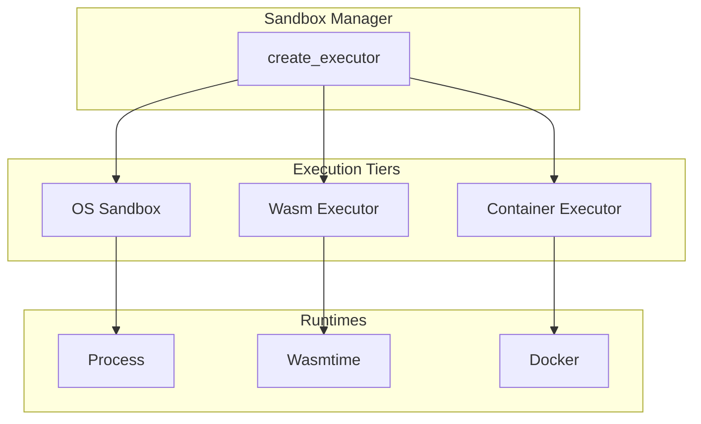

# Sandbox Module

OpenAgent provides multi-tier code execution environments for safely running generated code. This document describes the sandbox architecture and configuration.

## Overview

The sandbox module offers three isolation levels:

| Mode | Isolation | Performance | Use Case |
|------|-----------|-------------|----------|
| **OS** | Directory-restricted | Fastest | Trusted code, local development |
| **Wasm** | Memory sandbox | Fast | Untrusted code, simple scripts |
| **Container** | Full isolation | Slower | Complex environments, network access |

## Architecture



## OS Sandbox

The OS sandbox runs code as a restricted subprocess:

### Features
- **Directory restriction** - Can only access `allowed_dir`
- **Process isolation** - Runs with limited permissions
- **Resource limits** - Timeout enforcement
- **Language support** - Python, Node.js, Ruby, Shell, etc.

### Configuration

```toml
[sandbox]
execution_env = "os"
allowed_dir = "/tmp/openagent-workspace"
default_timeout = "30s"
max_timeout = "5m"
```

### Usage

```rust
use openagent::sandbox::{create_executor, ExecutionRequest, Language};

let config = SandboxConfig {
    execution_env: ExecutionEnv::Os,
    allowed_dir: PathBuf::from("/tmp/workspace"),
    ..Default::default()
};

let executor = create_executor(&config).await?;

let request = ExecutionRequest::new(
    "print('Hello, World!')",
    Language::Python
);

let result = executor.execute(request).await?;
println!("Output: {}", result.stdout);
```

### Security Considerations

- Code runs with the same user as OpenAgent
- Use `allowed_dir` to restrict file access
- Set appropriate timeouts
- Consider running OpenAgent in a container for additional isolation

## Wasm Sandbox

The Wasm sandbox uses Wasmtime for memory-safe execution:

### Features
- **Memory isolation** - Code cannot access host memory
- **No filesystem access** - Unless explicitly granted
- **No network access** - Fully sandboxed
- **Fast startup** - Near-native performance

### Configuration

```toml
[sandbox]
execution_env = "wasm"

[sandbox.wasm]
max_memory_mb = 256
max_fuel = 1000000
enable_wasi = true
allow_threads = false
```

### Language Support

The Wasm executor supports languages compiled to WebAssembly:
- Python (via Pyodide)
- JavaScript (via QuickJS)
- Rust (compiled to wasm32-wasi)
- Go (via TinyGo)

### Usage

```rust
let config = SandboxConfig {
    execution_env: ExecutionEnv::Wasm,
    wasm: WasmConfig {
        max_memory_mb: 256,
        max_fuel: Some(1000000),
        enable_wasi: true,
        ..Default::default()
    },
    ..Default::default()
};

let executor = create_executor(&config).await?;

let request = ExecutionRequest::new(
    "console.log('Hello from Wasm!')",
    Language::JavaScript
);

let result = executor.execute(request).await?;
```

### Limitations

- Limited library support
- No network access by default
- Some languages require compilation step

## Container Sandbox

The Container sandbox uses Docker for full isolation:

### Features
- **Full isolation** - Separate filesystem, network, processes
- **Custom images** - Use any Docker image
- **Network control** - Enable/disable as needed
- **Resource limits** - CPU, memory, disk

### Configuration

```toml
[sandbox]
execution_env = "container"

[sandbox.container]
default_image = "python:3.11-slim"
network_enabled = false
memory_limit = "256m"
cpu_limit = "1.0"
cleanup = true

[sandbox.container.images]
python = "python:3.11-slim"
node = "node:20-slim"
rust = "rust:1.75-slim"
go = "golang:1.21-alpine"
```

### Usage

```rust
let config = SandboxConfig {
    execution_env: ExecutionEnv::Container,
    container: ContainerConfig {
        default_image: "python:3.11-slim".to_string(),
        network_enabled: false,
        memory_limit: Some("256m".to_string()),
        cpu_limit: Some("1.0".to_string()),
        cleanup: true,
        ..Default::default()
    },
    ..Default::default()
};

let executor = create_executor(&config).await?;

// Use a specific image
let mut request = ExecutionRequest::new(
    "console.log('Hello from Node!')",
    Language::JavaScript
);
request.env.insert("IMAGE".to_string(), "node:20-slim".to_string());

let result = executor.execute(request).await?;
```

### Security Features

- **No network** by default (configurable)
- **Read-only filesystem** (except `/tmp`)
- **Dropped capabilities** - Minimal Linux capabilities
- **No privileged mode** - Never runs privileged containers
- **Auto-cleanup** - Containers removed after execution

## ExecutionRequest

All executors accept an `ExecutionRequest`:

```rust
pub struct ExecutionRequest {
    /// Code to execute
    pub code: String,
    /// Programming language
    pub language: Language,
    /// Standard input
    pub stdin: Option<String>,
    /// Execution timeout
    pub timeout: Duration,
    /// Environment variables
    pub env: HashMap<String, String>,
    /// Working directory
    pub working_dir: Option<PathBuf>,
}

impl ExecutionRequest {
    pub fn new(code: impl Into<String>, language: Language) -> Self {
        Self {
            code: code.into(),
            language,
            stdin: None,
            timeout: Duration::from_secs(30),
            env: HashMap::new(),
            working_dir: None,
        }
    }

    pub fn with_timeout(mut self, timeout: Duration) -> Self {
        self.timeout = timeout;
        self
    }

    pub fn with_stdin(mut self, stdin: impl Into<String>) -> Self {
        self.stdin = Some(stdin.into());
        self
    }
}
```

## ExecutionResult

All executors return an `ExecutionResult`:

```rust
pub struct ExecutionResult {
    /// Whether execution succeeded
    pub success: bool,
    /// Exit code (if available)
    pub exit_code: Option<i32>,
    /// Standard output
    pub stdout: String,
    /// Standard error
    pub stderr: String,
    /// Actual execution time
    pub execution_time: Duration,
    /// Whether execution timed out
    pub timed_out: bool,
}
```

## Supported Languages

| Language | OS | Wasm | Container |
|----------|:--:|:----:|:---------:|
| Python | ✅ | ✅ | ✅ |
| JavaScript | ✅ | ✅ | ✅ |
| TypeScript | ✅ | ❌ | ✅ |
| Rust | ✅ | ✅ | ✅ |
| Go | ✅ | ✅ | ✅ |
| Ruby | ✅ | ❌ | ✅ |
| Shell | ✅ | ❌ | ✅ |
| C/C++ | ✅ | ✅ | ✅ |

## Security Best Practices

### Development Environment

```toml
[sandbox]
execution_env = "os"
allowed_dir = "/tmp/openagent-workspace"
default_timeout = "60s"
```

### Production Environment

```toml
[sandbox]
execution_env = "container"

[sandbox.container]
network_enabled = false
memory_limit = "128m"
cpu_limit = "0.5"
cleanup = true
```

### High Security

```toml
[sandbox]
execution_env = "wasm"

[sandbox.wasm]
max_memory_mb = 64
max_fuel = 500000
enable_wasi = false  # No filesystem access
```

## Error Handling

```rust
use openagent::sandbox::{create_executor, ExecutionRequest, Language};
use openagent::error::{Error, Result};

async fn run_code(code: &str) -> Result<String> {
    let executor = create_executor(&config).await?;
    
    let request = ExecutionRequest::new(code, Language::Python)
        .with_timeout(Duration::from_secs(10));
    
    let result = executor.execute(request).await?;
    
    if result.timed_out {
        return Err(Error::Sandbox("Execution timed out".into()));
    }
    
    if !result.success {
        return Err(Error::Sandbox(format!(
            "Execution failed (exit {}): {}",
            result.exit_code.unwrap_or(-1),
            result.stderr
        )));
    }
    
    Ok(result.stdout)
}
```

## Next Steps

- [Configuration](./configuration.md) - Sandbox configuration options
- [Core Traits](./core-traits.md) - CodeExecutor trait details
- [Plugin SDK](./plugin-sdk.md) - Creating custom executors
